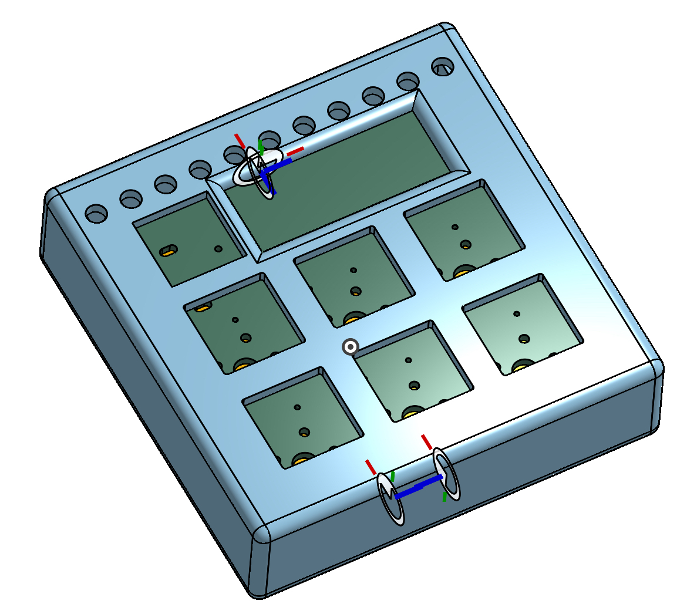

N-Pad

The N-Pad is a 7-key macropad, equipped with a rotary encoder, OLED screens and 16 addressable LED. The heart of this pad is XIAO RP2040, controlled via KMK firmware.
N-Pad compounds of 3 main elements: PCB, Bottom (main) part of the case and the top part.

Features:
    -6 + 1 keys with awesome functions
    -Rotary encoder to modify volume and PLAY/PAUSE function when pressed (the 7th key).
    -128x32 OLED screen displaying the volume level
    -16 addressable LEDs (6 right under the keys and rest and the back side of PCB for even brighter and smoother backlight, fancy light at the USB port too)
    - Years of big software updates coming!

Model of the N-Pad:

The case is from 2 parts: The bottom part (includes space for PCB with raised platforms).
The model shown a PCB with no parts on it, though contacts for keys visible.
