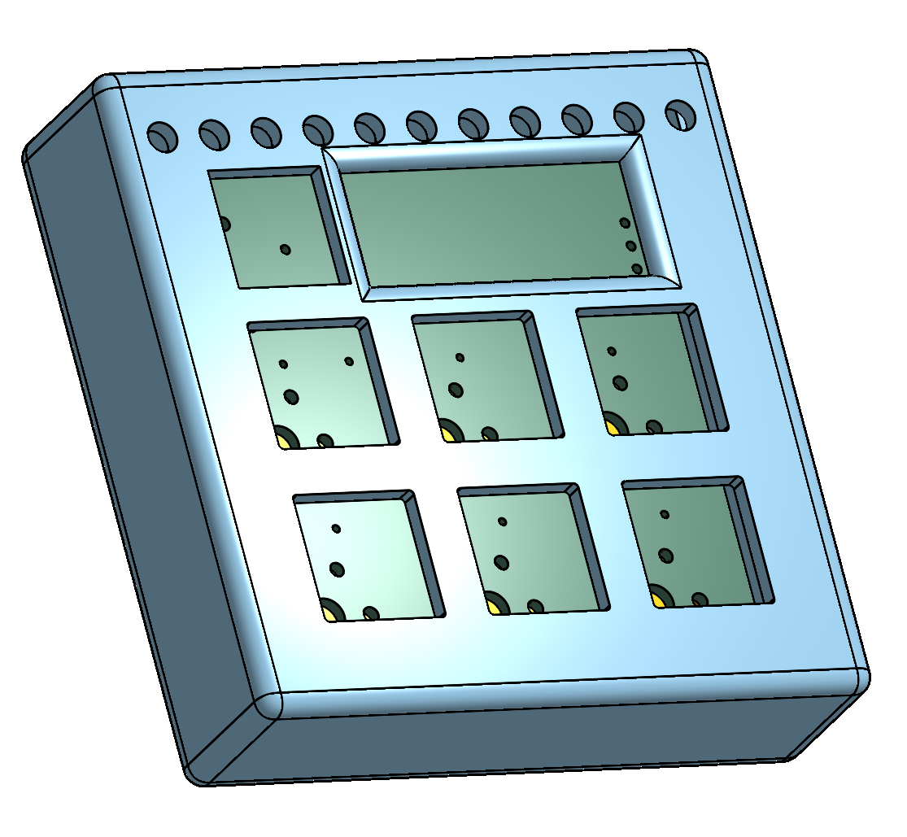
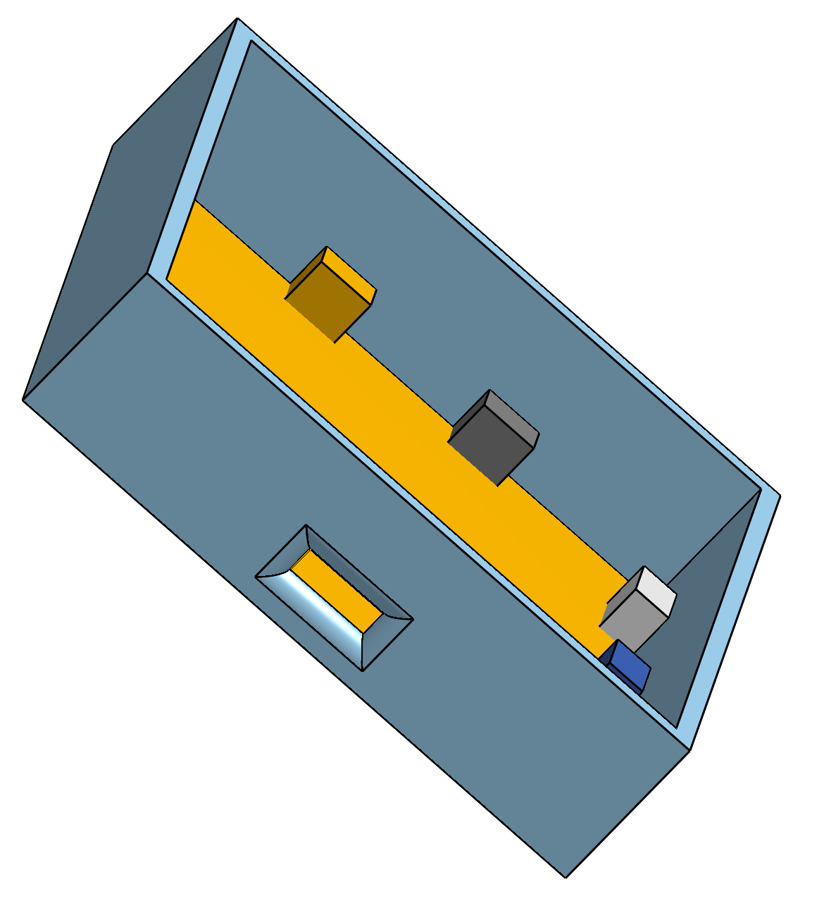
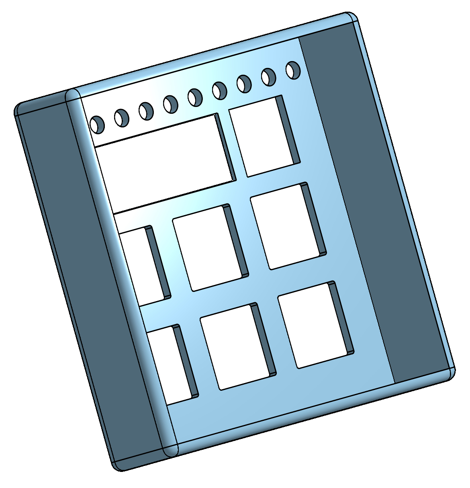

N-Pad

The N-Pad is a 7-key macropad, equipped with a rotary encoder, OLED screen and 16 addressable LEDs. The heart of this pad is XIAO RP2040, controlled via KMK firmware.
N-Pad compounds of 3 main elements: PCB, Bottom (main) part of the case and the top part.

Features:

    -6 + 1 keys with awesome functions
    -Rotary encoder to modify volume and MUTE function when pressed (the 7th key).
    -128x32 OLED screen displaying the volume level
    -16 addressable LEDs (6 right under the keys and rest and the back side of PCB for even brighter and smoother backlight, fancy light at the USB port too)
    - Years of big software updates coming!

Model of the N-Pad:

The case is from 2 parts: The bottom part (includes space for PCB with raised platforms). The top has cutouts for key switches, rotary encoder as well as OLED screen and can be easily taken off.

Bottom part:

Top part (shown from the back side):

Thanks to the detachable design, no screws are needed for assembly.

Note: The first image shown a PCB with no parts on it, though contacts for keys visible. Designed in OnShape.

PCB:

PCB was designed in KiCad, consists of two layers.

Schematic:

PCB:

Firmware:

The N-Pad uses KMK firmware, loads of software updates coming, stay tuned!

Keys curretnly represents these functions: Copy, Paste, Homescreen, Play/Pause, Undo, Save

BOM:

    6 Cherry MX Switches

    6 DSA Keycaps
    
    6 1N4148 DO-35 Diodes.
    
    16 WS2812B LEDs 
    
    1 0.91" 128x32 OLED Display
    
    1 EC11 Rotary Encoder
    
    1 XIAO RP2040
    
    1 PCB
    
    1 Case (2 printed parts - detachable design - see CAD and Production folders)
    
    
Designed in the UK, (will be) assembled in the Czech Republic, EU, with parts from more than one country (living in the Czech Republic but currently on a UK trip)
